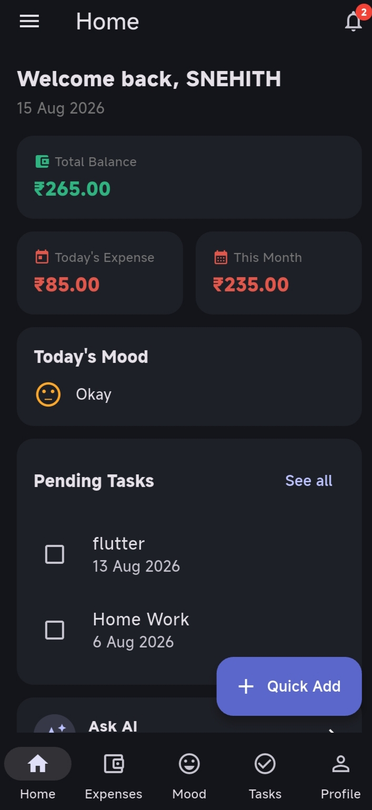
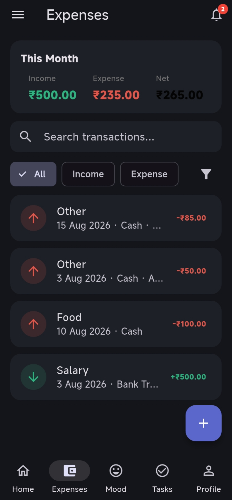
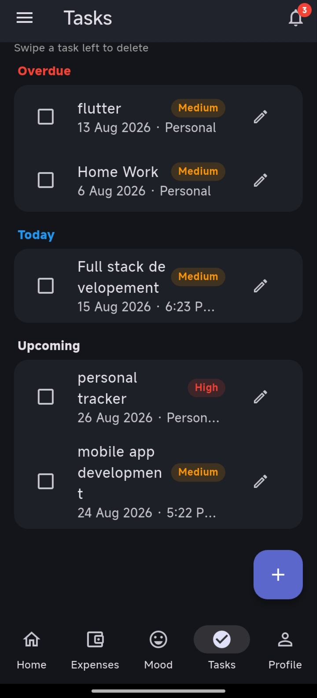
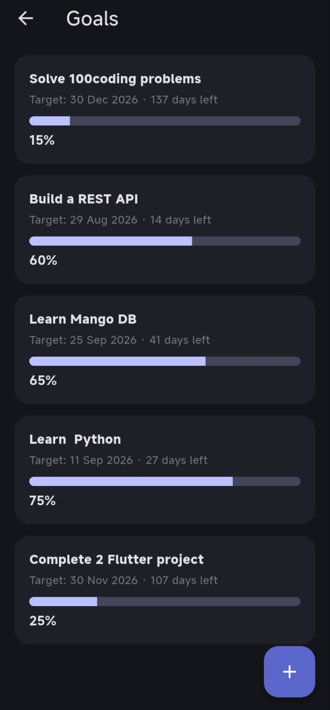

# Personal Tracker

**An all-in-one personal expense, mood, task, and goal tracker — built with Flutter.**

Track your money, your mood, your to-dos, and your goals in one clean, offline-first app. No account, no backend, no ads — everything lives on your device, and an optional AI assistant is built right in for when you just need to ask something.

<!--
  SCREENSHOTS: replace the placeholder paths below with your own images.
  1. Create a `screenshots/` folder in the project root.
  2. Add your PNG/JPG files there (e.g. screenshots/home.png).
  3. Keep the same filenames used below, or update the paths to match yours.
  Recommended: portrait phone screenshots, ~1080x2400, PNG.
-->

## Screenshots

| Home | Expenses | Reports |
|---|---|---|
|  |  |  |

| Mood Tracker | Tasks | Goals |
|---|---|---|
|  |  |  |

| Calendar | Ask AI | Settings |
|---|---|---|
|  |  |  |

<p align="center">
  
</p>

## Table of Contents

- [Features](#features)
- [Tech Stack](#tech-stack)
- [Getting Started](#getting-started)
- [Project Structure](#project-structure)
- [Key Packages](#key-packages)
- [Troubleshooting](#troubleshooting)
- [Roadmap Ideas](#roadmap-ideas)

## Features

### Money
- Add income & expenses with custom categories, payment method (Cash/Card/UPI/Bank/Other), and notes
- Recurring transactions (weekly/monthly) that auto-log themselves
- Category budgets with over-budget warnings
- Reports: income vs. expense, category breakdown, spending trend chart, weekly summary
- CSV export and full JSON backup/restore (copy-paste based — works across devices, no cloud account needed)

### Mood
- Daily mood check-in with a tappable calendar — log or edit *any* day, not just today
- Monthly mood summary and a nudge banner for days you haven't logged

### Tasks & Goals
- Tasks with due date + time, category, priority, checklists (sub-tasks), and repeat (daily/weekly/monthly)
- Goals with a target date, progress slider, and a "days left / overdue" indicator
- A Reminders screen that covers *every* task — overdue, upcoming, and even ones with no due date

### Notes & Calendar
- Quick notes with pinning and search
- A unified calendar view showing expenses, tasks, mood, goals, and notes for any day

### Ask AI
- A built-in chat assistant (bring your own OpenAI API key) for quick questions, right inside the app

### Extras
- Dark mode, PIN app lock, global search, birthday/age tracking, daily streak, motivational quotes, a "Welcome-Back Summary" popup that surfaces anything needing attention when you open the app

## Tech Stack

- **Flutter** (Dart) — cross-platform UI
- **State management:** a lightweight custom `InheritedNotifier` (`AppScope`) — no external state package
- **Storage:** `shared_preferences` (local JSON), fully offline
- **AI:** OpenAI Chat Completions API via `http` (user-supplied API key)

No native platform permissions are required anywhere in this app.

## Getting Started

### Prerequisites
- [Flutter SDK](https://docs.flutter.dev/get-started/install) (stable channel)
- A connected device, emulator, or desktop/web target

### Installation

```bash
# macOS/Linux
chmod +x setup.sh && ./setup.sh

# Windows (PowerShell)
.\setup.ps1
```

Or manually:

```bash
flutter create .
flutter pub get
flutter run
```

`flutter create .` generates the platform folders (`android/`, `ios/`, `web/`, etc.) around the existing source — it won't touch anything in `lib/`.

## Project Structure

```
lib/
  main.dart                  # App entry, navigation shell, startup logic
  theme.dart                 # Light/dark Material 3 themes
  models/                    # Transaction, MoodEntry, Task, Note, Goal, ChatMessage
  services/
    storage_service.dart     # SharedPreferences read/write helpers
    app_state.dart            # Single source of truth (ChangeNotifier)
    app_scope.dart            # InheritedNotifier so any screen can read state
    ai_service.dart           # OpenAI API integration
  screens/                   # One file per screen (Home, Expenses, Reports, ...)
  widgets/                   # Reusable UI components
  utils/formatters.dart      # Date/money formatting helpers
```

## Key Packages

| Package | Purpose |
|---|---|
| `shared_preferences` | Local JSON persistence for all data |
| `intl` | Date/number formatting |
| `uuid` | Generating unique IDs for records |
| `path_provider` | Locating a writable directory for CSV/backup export |
| `http` | Calling the OpenAI API for the "Ask AI" chat feature |

That's the complete dependency list — deliberately small, to keep the app easy to build and maintain.

## Troubleshooting

Ran into a build error? A few environment-specific issues (unrelated to the app's code) have come up before — see [`TROUBLESHOOTING.md`](TROUBLESHOOTING.md) for solutions to:
- Kotlin/Gradle errors after changing package versions (stale lockfile)
- A Kotlin compiler crash on Windows when the project and Flutter SDK are on different drive letters
- Where to find and share the exact error output if something new comes up

## Roadmap Ideas

- Swap `shared_preferences` for `sqflite` for larger datasets
- Richer charts via `fl_chart`
- Real OS push notifications (`flutter_local_notifications`) as an opt-in
- Automatic SMS reading (`flutter_sms_inbox`) as an opt-in, alongside the current paste-based flow
- Biometric app lock (`local_auth`) alongside the PIN

---

Built with Flutter.
